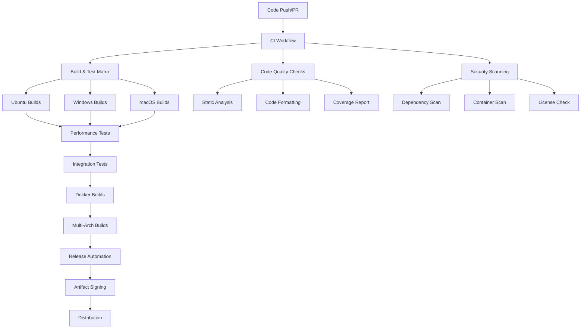

# CI/CD Pipeline Documentation

This document provides comprehensive information about the CI/CD pipeline architecture, workflows, and best practices for the cpp-scaffold project.

## 📋 Table of Contents

- [Overview](#overview)
- [Pipeline Architecture](#pipeline-architecture)
- [Workflow Details](#workflow-details)
- [Configuration](#configuration)
- [Troubleshooting](#troubleshooting)
- [Best Practices](#best-practices)
- [Maintenance](#maintenance)

## 🔍 Overview

The cpp-scaffold project uses GitHub Actions for continuous integration and deployment. The CI/CD pipeline is designed to:

- **Ensure Code Quality**: Automated testing, static analysis, and code formatting checks
- **Maintain Security**: Vulnerability scanning, dependency checks, and artifact signing
- **Optimize Performance**: Build caching, parallel execution, and performance monitoring
- **Support Multiple Platforms**: Cross-platform builds for Linux, Windows, and macOS
- **Enable Reproducibility**: Docker-based builds and consistent environments

## 🏗️ Pipeline Architecture



## 📊 Workflow Details

### Core Workflows

| Workflow | Trigger | Purpose | Duration |
|----------|---------|---------|----------|
| **CI** | Push, PR | Main build and test pipeline | ~15-20 min |
| **Security** | Push, PR, Schedule | Security scanning and compliance | ~10-15 min |
| **Performance** | Push, PR, Schedule | Performance benchmarks and regression detection | ~20-30 min |
| **Integration** | Push, PR, Schedule | End-to-end integration testing | ~25-35 min |
| **Docker Builds** | Push, PR, Schedule | Container image builds and testing | ~30-45 min |
| **Multi-Arch** | Push, PR, Release | Multi-architecture binary builds | ~40-60 min |
| **Release** | Tag creation | Automated release and distribution | ~20-30 min |
| **Monitoring** | Workflow completion | Pipeline health monitoring | ~5-10 min |

### Build Matrix

The CI pipeline supports multiple configurations:

#### Operating Systems
- **Ubuntu**: 20.04, 22.04, latest
- **Windows**: 2019, 2022, latest
- **macOS**: 12, 13, latest

#### Compilers
- **GCC**: 9, 11, 12, 13
- **Clang**: 12, 14, 15, 16
- **MSVC**: 2019, 2022, latest

#### Architectures
- **x86_64**: All platforms
- **ARM64**: Linux, macOS
- **ARM32**: Linux (cross-compilation)

## ⚙️ Configuration

### Environment Variables

Key environment variables used across workflows:

```yaml
env:
  BUILD_TYPE: Release
  CCACHE_MAX_SIZE: 2G
  CODECOV_TOKEN: ${{ secrets.CODECOV_TOKEN }}
  REGISTRY: ghcr.io
```

### Secrets Required

The following secrets must be configured in the repository:

- `CODECOV_TOKEN`: For code coverage reporting
- `GITHUB_TOKEN`: Automatically provided by GitHub
- Additional secrets for external integrations (if used)

### Cache Configuration

The pipeline uses multiple caching strategies:

1. **Dependency Caching**
   - vcpkg packages
   - Conan dependencies
   - CMake dependencies

2. **Build Caching**
   - ccache for compilation
   - CMake configuration cache

3. **Tool Caching**
   - Static analysis tools
   - Security scanners

## 🔧 Troubleshooting

### Common Issues

#### Build Failures

**Symptom**: Compilation errors in CI but builds locally
**Causes**:
- Different compiler versions
- Missing dependencies
- Environment differences

**Solutions**:
1. Check compiler matrix compatibility
2. Verify dependency installation steps
3. Use Docker builds for reproducibility

#### Cache Issues

**Symptom**: Slow builds despite caching
**Causes**:
- Cache key mismatches
- Cache corruption
- Cache size limits

**Solutions**:
1. Review cache key patterns
2. Clear cache manually if needed
3. Adjust cache size limits

#### Test Failures

**Symptom**: Tests fail in CI but pass locally
**Causes**:
- Timing issues in CI environment
- Resource constraints
- Platform-specific behavior

**Solutions**:
1. Increase test timeouts
2. Use CI-specific test configurations
3. Add platform-specific test exclusions

### Debug Strategies

1. **Enable Verbose Logging**
   ```yaml
   - name: Debug build
     run: cmake --build build --verbose
   ```

2. **Upload Debug Artifacts**
   ```yaml
   - name: Upload debug info
     if: failure()
     uses: actions/upload-artifact@v4
     with:
       name: debug-logs
       path: |
         build/
         *.log
   ```

3. **SSH Debug Access** (for critical issues)
   ```yaml
   - name: Setup tmate session
     if: failure()
     uses: mxschmitt/action-tmate@v3
   ```

## 📚 Best Practices

### Workflow Design

1. **Fail Fast**: Put quick checks first
2. **Parallel Execution**: Use matrix builds effectively
3. **Conditional Execution**: Skip unnecessary steps
4. **Resource Optimization**: Use appropriate runner sizes

### Security

1. **Minimal Permissions**: Use least privilege principle
2. **Secret Management**: Avoid hardcoded secrets
3. **Dependency Scanning**: Regular security updates
4. **Artifact Signing**: Sign all release artifacts

### Performance

1. **Caching Strategy**: Cache dependencies and build artifacts
2. **Build Optimization**: Use ccache and unity builds
3. **Parallel Builds**: Utilize all available cores
4. **Resource Monitoring**: Track build times and resource usage

### Maintenance

1. **Regular Updates**: Keep actions and tools updated
2. **Monitoring**: Track pipeline health metrics
3. **Documentation**: Keep CI docs current
4. **Testing**: Test CI changes in feature branches

## 🔄 Maintenance

### Regular Tasks

#### Weekly
- Review failed builds and fix issues
- Check dependency update PRs
- Monitor performance trends

#### Monthly
- Update GitHub Actions to latest versions
- Review and optimize cache usage
- Update documentation as needed

#### Quarterly
- Audit security configurations
- Review and update build matrix
- Performance optimization review

### Monitoring Dashboards

The pipeline includes automated monitoring:

1. **Build Health**: Success rates and failure patterns
2. **Performance Metrics**: Build times and resource usage
3. **Security Status**: Vulnerability scan results
4. **Dependency Status**: Update availability and security

### Emergency Procedures

#### Pipeline Outage
1. Check GitHub Actions status
2. Review recent workflow changes
3. Rollback problematic changes
4. Communicate status to team

#### Security Incident
1. Disable affected workflows
2. Review security scan results
3. Update vulnerable dependencies
4. Re-enable workflows after verification

## 📞 Support

For CI/CD related issues:

1. **Check Documentation**: Review this guide and workflow files
2. **Search Issues**: Look for similar problems in GitHub issues
3. **Create Issue**: Report new problems with detailed logs
4. **Contact Maintainers**: Reach out to the development team

## 📖 Additional Resources

- [GitHub Actions Documentation](https://docs.github.com/en/actions)
- [CMake Best Practices](https://cmake.org/cmake/help/latest/guide/user-interaction/index.html)
- [Docker Multi-platform Builds](https://docs.docker.com/build/building/multi-platform/)
- [Security Best Practices](https://docs.github.com/en/actions/security-guides)

---

*This documentation is automatically updated as part of the CI pipeline. Last updated: $(date)*
