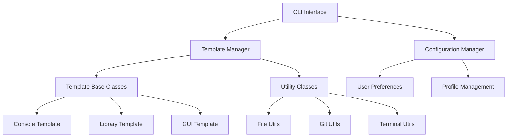

# Developer Guide

Welcome to the CPP-Scaffold developer guide! This section is for developers who want to contribute to CPP-Scaffold, extend its functionality, or understand its internal architecture.

## Overview

CPP-Scaffold is built with extensibility and maintainability in mind. Whether you want to fix bugs, add features, create custom templates, or contribute to the documentation, this guide will help you get started.

## What's in This Section

### [Architecture](architecture.md)

Comprehensive overview of CPP-Scaffold's architecture, design patterns, and component interactions.

### [Building](building.md)

Complete guide to building CPP-Scaffold from source, including development setup and build configurations.

### [Contributing](contributing.md)

Guidelines for contributing to the project, including code style, testing requirements, and the pull request process.

### [Extending](extending.md)

Learn how to extend CPP-Scaffold with custom templates, plugins, and integrations.

## Quick Start for Contributors

### 1. Set Up Development Environment

```bash
# Clone the repository
git clone https://github.com/cpp-scaffold/cpp-scaffold.git
cd cpp-scaffold

# Install dependencies (see Building guide for details)
# Build the project
mkdir build && cd build
cmake .. -G Ninja -DCMAKE_BUILD_TYPE=Debug
ninja

# Run tests
ctest
```

### 2. Understand the Codebase

```
src/
├── cli/                    # Command-line interface
├── config/                 # Configuration management
├── templates/              # Project templates
├── testing/               # Testing framework integration
├── utils/                 # Utility classes
└── main.cpp               # Application entry point
```

### 3. Make Your First Contribution

1. **Find an issue** - Look for "good first issue" labels
2. **Create a branch** - Use descriptive branch names
3. **Make changes** - Follow our coding standards
4. **Add tests** - Ensure your changes are tested
5. **Submit PR** - Include clear description and tests

## Development Workflow

### Code Organization

CPP-Scaffold follows a modular architecture:

- **CLI Layer** - User interface and argument parsing
- **Core Engine** - Template management and project generation
- **Utility Layer** - Cross-platform utilities and helpers
- **Testing** - Comprehensive test suite

### Design Principles

1. **Modularity** - Clear separation of concerns
2. **Extensibility** - Easy to add new templates and features
3. **Cross-platform** - Works on Windows, macOS, and Linux
4. **Modern C++** - Uses C++17 features and best practices
5. **Testing** - Comprehensive unit and integration tests

### Coding Standards

- **C++17** standard compliance
- **clang-format** for code formatting
- **clang-tidy** for static analysis
- **Google Test** for unit testing
- **Doxygen** comments for public APIs

## Architecture Overview



## Key Components

### Template System

- **Factory pattern** for template creation
- **Inheritance hierarchy** for shared functionality
- **Plugin architecture** for custom templates

### Configuration Management

- **Hierarchical settings** with defaults and overrides
- **Profile system** for saved configurations
- **Cross-platform** configuration storage

### CLI Parser

- **Type-safe** argument parsing
- **Rich validation** with helpful error messages
- **Interactive wizard** for guided setup

## Testing Strategy

### Unit Tests

- **Component isolation** - Test individual classes
- **Mock dependencies** - Use mocks for external dependencies
- **Edge cases** - Test boundary conditions and error paths

### Integration Tests

- **End-to-end** - Test complete workflows
- **Cross-platform** - Verify behavior on all platforms
- **Template validation** - Ensure generated projects build correctly

### Continuous Integration

- **Multiple platforms** - Windows, macOS, Linux
- **Multiple compilers** - GCC, Clang, MSVC
- **Code quality** - Static analysis and formatting checks

## Contributing Areas

### Code Contributions

- **Bug fixes** - Fix reported issues
- **New features** - Add requested functionality
- **Performance** - Optimize critical paths
- **Refactoring** - Improve code quality

### Template Contributions

- **New templates** - Add support for new project types
- **Template improvements** - Enhance existing templates
- **Framework integration** - Add support for new frameworks

### Documentation

- **API documentation** - Improve code documentation
- **User guides** - Write tutorials and examples
- **Architecture docs** - Document design decisions

### Testing

- **Test coverage** - Increase test coverage
- **Test quality** - Improve test reliability
- **Performance tests** - Add benchmarking

## Release Process

### Version Management

- **Semantic versioning** - Major.Minor.Patch
- **Release branches** - Stable release preparation
- **Hotfix process** - Critical bug fixes

### Quality Gates

- **All tests pass** - Unit and integration tests
- **Code review** - Peer review required
- **Documentation** - Updated for new features
- **Performance** - No regressions

## Community

### Communication Channels

- **GitHub Issues** - Bug reports and feature requests
- **GitHub Discussions** - Questions and general discussion
- **Pull Requests** - Code contributions and reviews

### Code of Conduct

We follow the [Contributor Covenant](https://www.contributor-covenant.org/) code of conduct. Please be respectful and inclusive in all interactions.

### Recognition

Contributors are recognized in:

- **CONTRIBUTORS.md** file
- **Release notes** for significant contributions
- **GitHub contributors** page

## Getting Help

### For Contributors

- **Architecture questions** - Ask in GitHub Discussions
- **Implementation help** - Comment on relevant issues
- **Code review** - Request reviews from maintainers

### For Users

- **Bug reports** - Use GitHub Issues with bug template
- **Feature requests** - Use GitHub Issues with feature template
- **Usage questions** - Use GitHub Discussions

Ready to contribute? Start with the [Building Guide](building.md) to set up your development environment!
