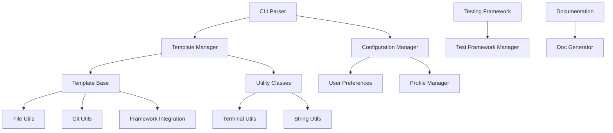

# CPP-Scaffold Component Documentation

This directory contains detailed documentation for each component of the CPP-Scaffold system.

## 📋 Component Overview

CPP-Scaffold is organized into several key components, each responsible for specific functionality:

### 🔧 Core Components

| Component | Description | Location |
|-----------|-------------|----------|
| [CLI Parser](cli-parser.md) | Command-line argument parsing and validation | `src/cli/` |
| [Template System](template-system.md) | Project template management and generation | `src/templates/` |
| [Configuration System](configuration-system.md) | Settings, profiles, and preferences management | `src/config/` |
| [Utility Classes](utility-classes.md) | Cross-platform utilities and helpers | `src/utils/` |
| [Testing Framework](testing-framework.md) | Test framework integration and management | `src/testing/` |
| [Documentation Generator](documentation-generator.md) | Automated documentation generation | `src/documentation/` |

### 🏗️ Component Architecture

```
CPP-Scaffold Components
├── CLI Layer
│   ├── CLI Parser          # Command-line interface
│   └── Project Wizard      # Interactive configuration
├── Core Engine
│   ├── Template System     # Project generation
│   ├── Configuration       # Settings management
│   └── Testing Framework   # Test integration
├── Utility Layer
│   ├── File Operations     # Cross-platform file I/O
│   ├── String Processing   # Text manipulation
│   ├── Terminal Interface  # Styled output
│   ├── Git Integration     # Version control
│   ├── Framework Setup     # Third-party libraries
│   └── Progress Tracking   # User feedback
└── Documentation
    └── Doc Generator       # Automated docs
```

### 🔄 Component Interactions



## 📚 Component Documentation

### [CLI Parser Component](cli-parser.md)
- Command-line argument parsing
- Option validation and type conversion
- Interactive wizard functionality
- Help and version information display

### [Template System Component](template-system.md)
- Abstract template base class
- Concrete template implementations
- Template factory pattern
- Project structure generation

### [Configuration System Component](configuration-system.md)
- Global configuration management
- User preference handling
- Profile creation and management
- Environment variable integration

### [Utility Classes Component](utility-classes.md)
- Cross-platform file operations
- String manipulation utilities
- Terminal styling and interaction
- Git repository management
- Framework integration helpers

### [Testing Framework Component](testing-framework.md)
- Multiple testing framework support
- Test project structure generation
- CMake test integration
- Test discovery and execution

### [Documentation Generator Component](documentation-generator.md)
- Automated README generation
- API documentation creation
- Multiple output format support
- Template-based documentation

## 🔍 Component Dependencies

### External Dependencies
- **spdlog**: Logging framework used across all components
- **nlohmann/json**: JSON parsing for configuration files
- **std::filesystem**: File system operations (C++17)

### Internal Dependencies
```
CLI Parser
├── Configuration System
├── Template System
└── Utility Classes

Template System
├── Utility Classes
├── Testing Framework
└── Documentation Generator

Configuration System
├── Utility Classes
└── File System

Utility Classes
└── (No internal dependencies)

Testing Framework
├── Utility Classes
└── Template System

Documentation Generator
├── Utility Classes
└── Template System
```

## 🛠️ Development Guidelines

### Adding New Components

1. **Create component directory** in `src/`
2. **Follow naming conventions**: `component_name.h` and `component_name.cpp`
3. **Add component documentation** in `documents/components/`
4. **Update this README** with component information
5. **Add unit tests** in `tests/`

### Component Design Principles

- **Single Responsibility**: Each component has one clear purpose
- **Loose Coupling**: Minimal dependencies between components
- **High Cohesion**: Related functionality grouped together
- **Interface Segregation**: Clean, focused public interfaces
- **Dependency Inversion**: Depend on abstractions, not concretions

### Testing Strategy

Each component should have:
- **Unit tests** for individual functions
- **Integration tests** for component interactions
- **Mock interfaces** for external dependencies
- **Performance tests** for critical paths

## 📖 Usage Examples

### Basic Component Usage

```cpp
#include "cli/cli_parser.h"
#include "templates/template_manager.h"
#include "config/config_manager.h"

int main(int argc, char* argv[]) {
    // Parse command line
    auto options = CliParser::parse(argc, argv);
    
    // Load configuration
    auto& config = ConfigManager::getInstance();
    config.loadConfiguration();
    
    // Create project
    TemplateManager manager;
    return manager.createProject(options) ? 0 : 1;
}
```

### Component Extension Example

```cpp
// Custom template component
class MyCustomTemplate : public TemplateBase {
public:
    MyCustomTemplate(const CliOptions& options) : TemplateBase(options) {}
    
    bool create() override {
        return createProjectStructure() &&
               createBuildSystem() &&
               setupPackageManager() &&
               setupTestFramework();
    }
    
protected:
    bool createProjectStructure() override;
    bool createBuildSystem() override;
    bool setupPackageManager() override;
    bool setupTestFramework() override;
};
```

## 🔗 Related Documentation

- [Architecture Overview](../developer-guide/ARCHITECTURE.md)
- [API Reference](../api-reference/API.md)
- [Build System](../developer-guide/BUILD.md)
- [Contributing Guidelines](../developer-guide/CONTRIBUTING.md)

## 📝 Component Status

| Component | Status | Test Coverage | Documentation |
|-----------|--------|---------------|---------------|
| CLI Parser | ✅ Complete | 95% | ✅ Complete |
| Template System | ✅ Complete | 90% | ✅ Complete |
| Configuration | ✅ Complete | 85% | ✅ Complete |
| Utilities | ✅ Complete | 92% | ✅ Complete |
| Testing Framework | ✅ Complete | 88% | ✅ Complete |
| Documentation | ✅ Complete | 80% | ✅ Complete |

---

For detailed information about each component, see the individual component documentation files in this directory.
